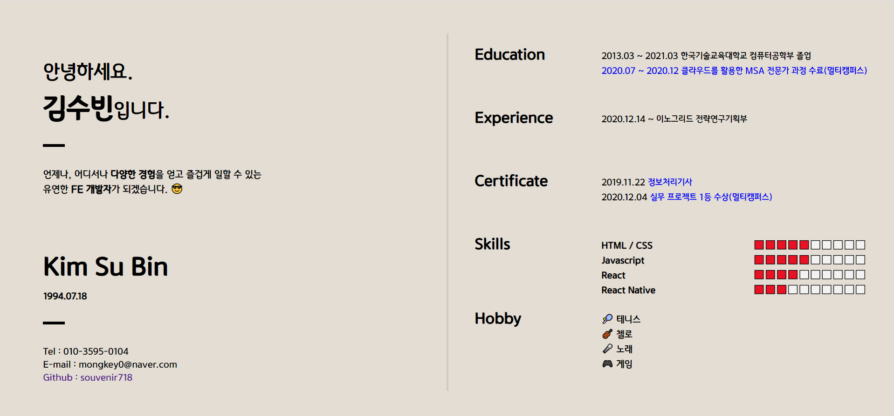
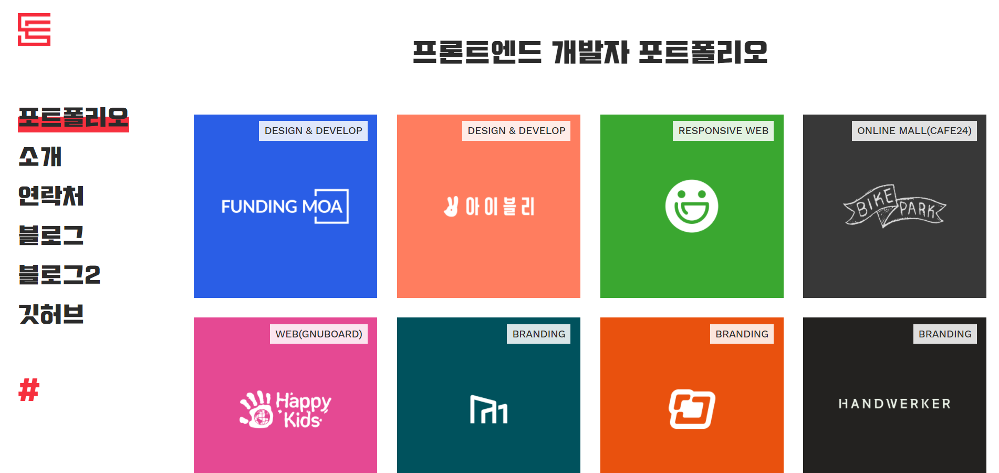
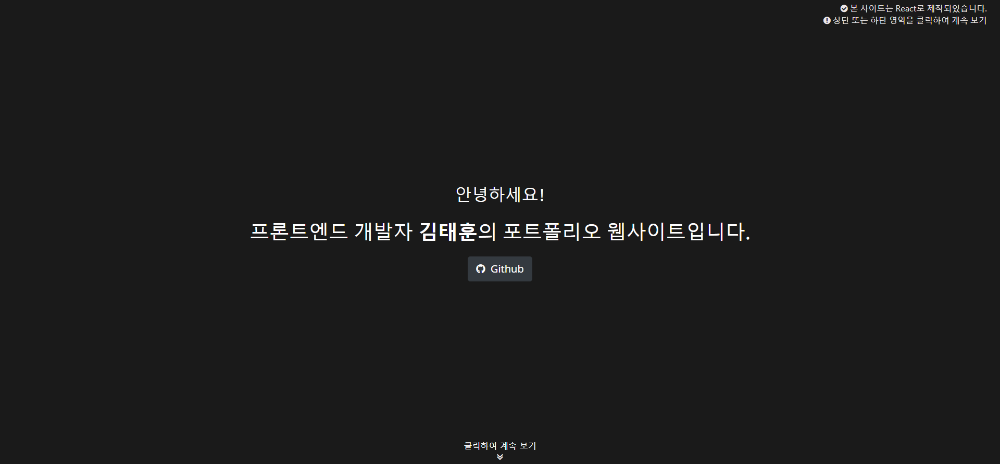
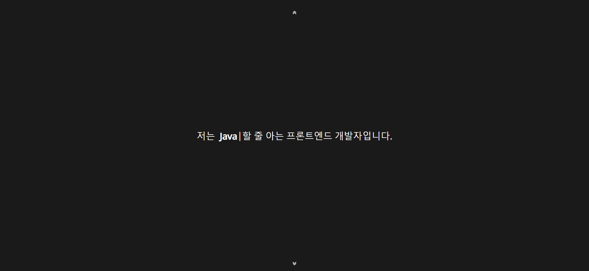
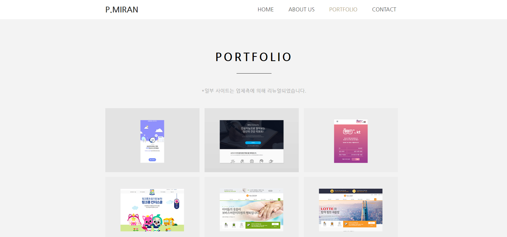

# 포트폴리오 레퍼런스 정리

## 메인 페이지 

### [메인페이지](https://souvenir718.github.io/)

 

> 코드는 [깃헙](https://github.com/souvenir718/souvenir718.github.io) 여기에 올리고 있습니다.
>
> 현재까지 진행부분은 위에처럼 메인페이지만 구성.
>
> 글씨체도 고민중에 있습니다..ㅠ.ㅠ

### 메인페이지 레퍼런스([*핀터레스트*](https://www.pinterest.co.kr/pin/799037158878868007/visual-search/?x=10&y=10&w=530&h=297&cropSource=6))

 

> 기존과 다르게 사진이랑 동그란 무늬를 빼니까 확실히 비어있는 느낌..
>
> 이부분은 고민중

## 추가적으로 필요한 페이지

필요한 페이지의 방향은 작게라도 한 **프로젝트**부터 시작해서 멀티캠퍼스에서 한 팀단위 프로젝트 등을  소개하거나 링크를 통해 해당 프로젝트 소개페이지, 배포가 되어있다면 배포 페이지로 이동할 수 있게끔 하는 페이지 구상중.. [프로젝트 정리한 md](https://github.com/souvenir718/souvenir718.github.io/blob/master/README.md) 여기에 글로 정리되어 있는걸 좀 더 시각적으로 보여줄 수 있는 방법에 대해 생각중입니다. 😅

### [1번 레퍼런스](https://chanspark.github.io/portfolio/index.html)

  

> 저런식으로 박스형식? 카드형식? 으로 하는 방법이 제일 무난할 거 같아요. 
>
> 카드형식에 \#React 이런 해쉬태그처럼 나타내는 방법도 괜찮지 않을까 생각중입니다 ㅎㅎ
>
> 저 사이트에 상세페이지에 보면 간단한 소개, 배포 주소로 이동하는 버튼 구성은 좋은거같아요.

### [2번 레퍼런스](https://th-portfolio.firebaseapp.com/)

 

> 이 페이지 경우 깔끔하게 아래 버튼으로 넘기는 부분이 좋은 것 같아요
>
> 그리구 다른페이지보다 두번째 사진에서 커서부분이 수정되면서 자기가 할 수 있는 기술 소개하는 부분은 참신한? 느낌 

### [3번 레퍼런스](http://www.parkmiran.com/)

> 여기는 다른 부분보다는 위의 사진에 프로젝트 소개하는 곳이 깔끔한 느낌이라 호버했을때 간단한 설명처럼 나오는것두 괜찮더라구여 색감이 좀 어둡둡한거 같긴하지만ㅋㅋㅋ